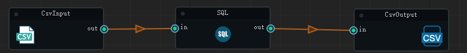

## NiceFlow

> 类似Kettle数据ETL工具，同时比Kettle更加易用和轻量

### 特性
- 基于python的插件机制,目前提供70+插件,同时支持自定义插件
- 基于json的flow任务，支持自定义任务配置




### 安装依赖

```shell
pip install NiceFlow
```


#### 测试案例

- plugin_test.py 测试插件功能
- flow_test.py 测试flow功能


#### cli使用

```shell
pip install NiceFlow

# 执行flow任务
NiceFlow exec --path csv_input_ck_output.json


NiceFlow exec --path 1.json


```


#### 代码使用

- faker_input_console.json

```json
{
  "flow": {
    "name": "",
    "uid": "",
    "param": {

    } },
  "nodes": [
    {
      "id": "FakerInput",
      "name": "read1",
      "type": "input",
      "properties": {
        "rows":10000,
        "columns": ["name","address","city","street_address","date_of_birth","phone_number"],
        "randoms":[
          {"key":"sex","values":["男","女","未知"]}
        ]
      }
    },
    {
      "id": "Console",
      "name": "write1",
      "type": "output",
      "properties": {
        "row": 100
      }
    }
  ],
  "edges": [
    {
      "startId": "read1",
      "endId": "write1"
    }
  ]
}

```


```python
import os
from NiceFlow.core.flow import Flow
from NiceFlow.core.manager import FlowManager

def getProjectPath() -> str:
    # 获取当前文件的绝对路径
    current_file = os.path.abspath(__file__)
    # 获取当前文件所在目录的绝对路径
    current_directory = os.path.dirname(current_file)
    # 获取当前项目的根目录
    project_root = os.path.dirname(os.path.dirname(current_directory))
    return project_root


def test_base():
    path = getProjectPath() + "/doc/faker_input_console.json"
    myFlow: Flow = FlowManager.read(path)
    myFlow.run()


if __name__ == '__main__':
    test_base()

```


### 架构图


### 插件使用说明文档


#### 输入

| 插件              | 功能             | 完成情况 | 文档                            |
|-----------------|----------------|------|-------------------------------|
| Starter         | 启动器            | 完成   | [启动器](doc/doc/Starter.md)     |
| CsvInput        | 读取CSV数据        | 完成   | [CSV输入](doc/doc/CSVInput.md ) |
| FakerInput      | 假数据生成          | 完成   |  [假数据生成](doc/doc/FakerInput.md) |       
| ParquetInput    | 读取Parquet数据    | 完成   | [Parquet输入](doc/doc/ParquetInput.md)    |    
| ExcelInput      | 读取Excel数据      | 完成   | [Excel输入](doc/doc/ExcelInput.md) |           
| MySQLInput      | 读取MySQL数据      | 完成   | [MySQL输入](doc/doc/MySQLInput.md) |           
| DuckDBInput     | 读取DuckDB数据     | 完成   | [DuckDB输入](doc/doc/DuckDBInput.md) |         
| AkshareInput    | 读取金融股票等财经数据    | 完成   | [Akshare输入](doc/doc/AkshareInput.md) |
| ClickHouseInput | 读取ClickHouse数据 | 完成   | [ClickHouse输入](doc/doc/ClickHouseInput.md) |
| OdpsInput       | 读取MaxCompute数据 | 完成   | [Odps输入](doc/doc/OdpsInput.md) |           
| ESInput         | 读取Elasticsearch数据 | 完成   | [Elasticsearch输入](doc/doc/ESInput.md) |         
| MongoDBInput    | 读取MongoDB数据    | 完成   | [MongoDB输入](doc/doc/MongoDBInput.md) |


#### 转换

| 插件             | 功能     | 完成情况 | 文档                       |
|----------------|--------|------|--------------------------|
| Filter         | 过滤器    | 完成   | [过滤器](doc/doc/Filter.md) |
| Mapping        | 映射器    | 完成   | [映射器](doc/doc/Mapping.md)    |
| For            | 遍历器    | 完成   | [遍历器](doc/doc/For.md)    |  
| IF             | 条件判断器  | 完成   | [条件判断器](doc/doc/IF.md) |
| Join           | 连接器    | 完成   | [连接器](doc/doc/Join.md)  |
| Mask           | 脱敏器    | 完成   | [脱敏器](doc/doc/Mask.md) |
| Pivot          | 透视表    | 完成   | [透视表](doc/doc/Pivot.md) |
| Printer        | 日志打印器  | 完成   | [打印器](doc/doc/Printer.md) |
| RegularExtract | 正则提取器  |      | [正则提取器](doc/doc/RegularExtract.md) |  
| Rename         | 重命名器   | 完成   | [重命名器](doc/doc/Rename.md) |
| Samples        | 采样器    | 完成   | [采样器](doc/doc/Samples.md) |
| Sort           | 排序器    | 完成   | [排序器](doc/doc/Sort.md) |
| Sql            | SQL转换器 | 完成   | [SQL转换器](doc/doc/SqlTransform.md) |
| Switch         | 条件转换器  |      | [条件转换器](doc/doc/Switch.md) |
| Unpivot        | 取消透视表  | 完成   | [取消透视表](doc/doc/Unpivot.md) |
| Variable       | 变量转换器  | 完成   | [变量转换器](doc/doc/Variants.md) |
| While          | 循环转换器  | 完成   | [循环转换器](doc/doc/While.md) |
| Duplicate      | 去重器    | 完成   | [去重器](doc/doc/Duplicate.md) |
| Console        | 控制台打印  | 完成   | [控制台输出](doc/doc/Console.md)    |


#### 输出
| 插件              | 功能           | 完成情况 | 文档                            |
|-----------------|------------|------|-------------------------------|
| FileOutput      | 文件输出           | 完成   | [文件输出](doc/doc/FileOutput.md) |
| KafkaOutput     | Kafka输出          | 完成   | [Kafka输出](doc/doc/KafkaOutput.md) |
| SqlServerOutput | SQLServer输出 | 完成   | [SQLServer输出](doc/doc/SqlServerOutput.md) |
| S3Output        | S3输出            | 完成   | [S3输出](doc/doc/S3Output.md) |
| PulsarOutput    | Pulsar输出         | 完成   | [Pulsar输出](doc/doc/PulsarOutput.md) |
| PostgresOutput  | Postgres输出       | 完成   | [Postgres输出](doc/doc/PostgresOutput.md) |
| ParquetOutput   | Parquet输出        | 完成   | [Parquet输出](doc/doc/ParquetOutput.md) |
| PaimonOutput    | Paimon输出         | 完成   | [Paimon输出](doc/doc/PaimonOutput.md) |
| OracleOutput    | Oracle输出         | 完成   | [Oracle输出](doc/doc/OracleOutput.md) |
| OdpsOutput      | MaxCompute输出     | 完成   | [MaxCompute输出](doc/doc/OdpsOutput.md) |
| MySQLOutput     | MySQL输出          | 完成   | [MySQL输出](doc/doc/MySQLOutput.md) |
| MqttOutput      | MQTT输出           |      |      |                               |
| MongoDBOutput   | MongoDB输出        | 完成   | [MongoDB输出](doc/doc/MongoDBOutput.md) |
| MarkdownOutput  | Markdown输出        |      |      |                               |
| HttpOutput      | Http输出         |      |      |                               |
| HiveOutput      | Hive输出         |      |      |                               |
| HdfsOutput      | HDFS输出        |      |      |                               |
| FtpOutput       | FTP输出            |      |      |                               |
| ExcelOutput     | Excel输出          |      |      |          |  
| EsOutput        | Elasticsearch输出 |      |      |
| DuckOutput      | DuckDB输出         |      |      |
| CsvOutput       | CSV输出           |      |      |
| CosOutput       | COS输出           |      |      |
| ClickHouseOutput | ClickHouse输出    |      |      |


### 数据实战

